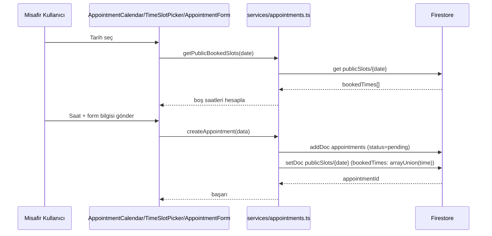
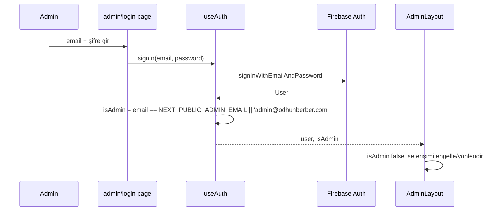
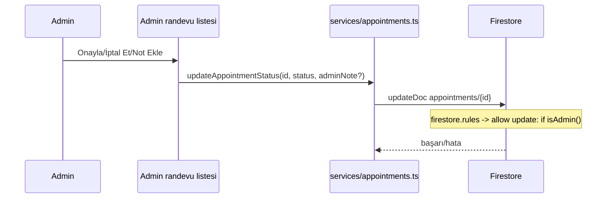

# Veri Akışları

## Amaç
Önemli süreçlerin uçtan uca veri akışını göstermek.

## Kapsam
Randevu oluşturma, admin girişi, randevu durumu güncelleme.

## Kullanım Şekli
Bu akışlardan birini değiştiren bir görev öncesi ilgili diyagram gözden geçirilmeli; akış değişirse diyagram güncellenmeli.

## Randevu Oluşturma (Misafir)

Not: `publicSlots` yazımı `try/catch` içinde "non-critical" olarak işaretli — bu adım başarısız olsa bile randevu oluşturulmuş sayılır (`src/services/appointments.ts` yorumu: "Non-critical — appointment still created"). Bu durumda o saat dilimi `publicSlots`'ta "dolu" görünmeyebilir ama gerçek randevu (`appointments` koleksiyonunda) var olur — çift randevu riski.

## Admin Girişi

## Randevu Durum Güncelleme (Admin)

Not: `publicSlots.bookedTimes` bu akışta **güncellenmiyor** — randevu iptal edilse veya silinse bile o saatin `publicSlots`'tan çıkarıldığına dair kod bulunamadı. Durum: Doğrulanamadı, bkz. [../docs/business-rules.md](../docs/business-rules.md).

## Örnekler
Yukarıdaki üç akış, kod tabanından doğrudan çıkarılmıştır (`src/services/appointments.ts`, `src/hooks/useAuth.ts`).

## Güncelleme Koşulları
Randevu akışı, admin girişi veya durum güncelleme mantığı değiştiğinde güncellenmelidir.

## İlgili Dosyalar
[../docs/business-rules.md](../docs/business-rules.md), [modules.md](modules.md)

## Son Güncelleme
2026-07-15
