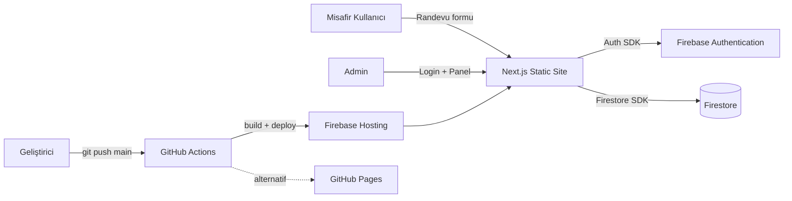

# Sistem Mimarisi

## Amaç
Sistemin genel mimari yapısını tek bir yerden anlaşılır kılmak.

## Kapsam
Tüm bileşenler, katmanlar, dış sistemler.

## Kullanım Şekli
Yeni bir mimari katman eklemeden önce (ör. backend servisi, üçüncü taraf entegrasyon) bu dosyaya bakılır ve büyük değişiklik öncesi kullanıcı onayı alınır.

## Ana Bileşenler
- **İstemci (Browser):** Next.js 14 App Router ile üretilmiş statik site (`output: 'export'`). Sunucu tarafı render yok — tüm veri erişimi ve mantık tarayıcıda çalışır.
- **Firebase Authentication:** Yalnızca admin girişi için email/password.
- **Firebase Firestore:** Tek veri katmanı — randevular, hizmetler, ayarlar, tatil günleri, saat müsaitliği.
- **Firebase Hosting:** Statik dosyaların (`out/`) sunulduğu üretim ortamı.
- **GitHub Actions:** CI/CD — `main` branch push'unda build + Firebase Hosting deploy (ve alternatif GitHub Pages deploy).
- **next-pwa (Workbox):** Service worker üretimi, offline/installable PWA desteği.

## Katmanlar (İstemci İçi)
```
src/app/            → Sayfalar (route'lar), yalnızca sunum + orkestrasyon
src/components/      → UI bileşenleri (home, booking, admin, layout, ui)
src/hooks/           → React state/yan etki katmanı (useAuth, useAppointments, useIsMobile)
src/services/        → Firestore veri erişim katmanı (repository benzeri)
src/firebase/        → Firebase SDK init (app/auth/db)
src/lib/, src/types/ → Sabitler, yardımcılar, paylaşılan tipler
```

## Bağımlılık Yönü
`app → components → hooks → services → firebase` (tek yönlü; tersine bağımlılık yok). `lib` ve `types` her katman tarafından kullanılabilir (yaprak düğüm).

## Dış Sistemler
| Sistem | Amaç | Bağlantı Şekli |
|---|---|---|
| Firebase Auth | Admin kimlik doğrulama | `firebase/auth` SDK, client-side |
| Firebase Firestore | Veri saklama | `firebase/firestore` SDK, client-side |
| Firebase Hosting | Statik site barındırma | `firebase deploy` |
| GitHub Actions | CI/CD | Workflow dosyaları |
| Google Maps | Konum gösterimi | Statik link (`mapUrl`), API entegrasyonu yok |

## Çalışma Ortamları
Lokal (`npm run dev`) → Production (Firebase Hosting). Ayrı bir staging ortamı **tespit edilmedi** (Doğrulanamadı, bkz. [../docs/deployment.md](../docs/deployment.md)).

## Ölçeklenebilirlik Yaklaşımı
Statik site + serverless BaaS (Firestore) olduğu için trafik ölçeklenmesi Firebase'in kendi altyapısına devredilmiştir. Uygulama tarafında ayrı bir ölçekleme stratejisi yoktur (sunucu yok).

## Kritik Teknik Sınırlar
- `output: 'export'` nedeniyle Next.js API Routes, SSR, ISR **kullanılamaz**. Herhangi bir sunucu-taraflı mantık gerekiyorsa Firebase Cloud Functions gibi ayrı bir servis gerekir.
- Tüm yetkilendirme mantığı Firestore Security Rules'a dayanır — istemci kodu güvenlik sınırı değildir.
- `images.unoptimized: true` — Next.js image optimizasyonu yoktur (statik export kısıtı).

## Diyagram


## Güncelleme Koşulları
Yeni bir dış sistem eklendiğinde veya katman yapısı değiştiğinde güncellenmelidir.

## İlgili Dosyalar
[modules.md](modules.md), [data-flow.md](data-flow.md), [integrations.md](integrations.md)

## Son Güncelleme
2026-07-15
